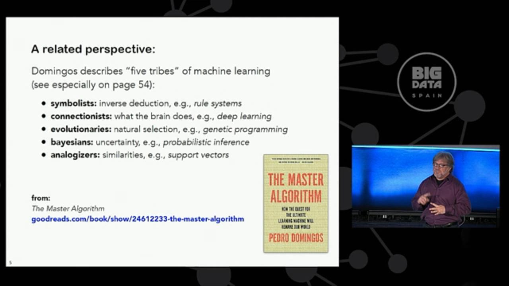
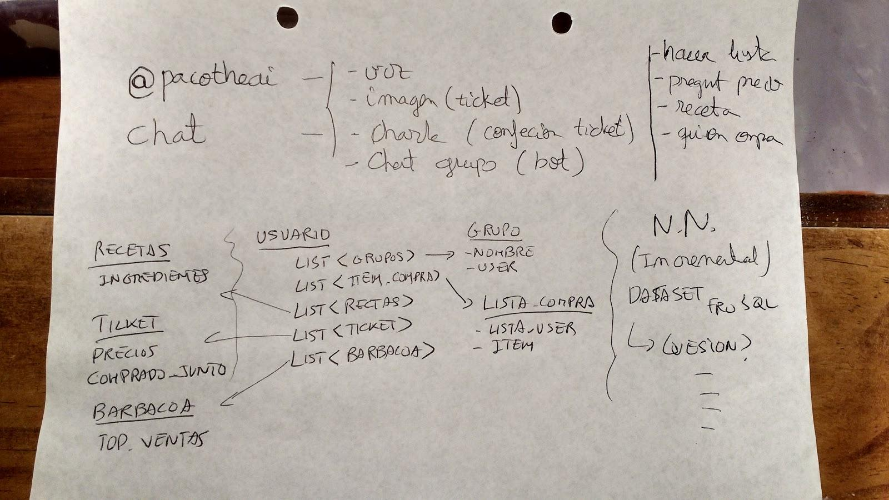

= Paco Machine Learning
Jose Juan Montiel
2017-07-09
:jbake-type: post
:jbake-tags: jvm,hippocms
:jbake-status: draft
:jbake-lang: es
:source-highlighter: prettify
:id: pml
:imagesdir:
:icons: font

== Paco Machine Learning

=== Enfoques posibles…
Uno o varios canales de entrada unificados, mediante varios chats bots permiten unificar la entrada de datos (chats) de distintos lugares. Por ejemplo Facebook Messenger y Telegram.

En el procesado lenguaje (NLP) permite extraer de los chats predicados e información.
Puede usar directamente http://opennlp.apache.org/[Open NLP] (modelos en http://opennlp.sourceforge.net/models-1.5[español])

Toda esta info (chats y extracción unificada de metainformación del lenguaje) se ve unificada en un dashboard, que permitirá ciertas acciones. Una libreria de https://github.com/encog/encog-java-core[ML] que mediante un DSL desde ese dashboard permitirá refinar el entrenamiento.

Para la charla, solo trabajaremos sobre un dominio de aplicación (cafes?) por lo que gracias al dashboard, al refinamiento del entrenamiento y al uso de APIs (via DSL que permita ofrecer “respuestas”) automatizar las respuestas a preguntas, e incluso las sugerencias (más la parte de ML).

Ya como PRO podíamos montar un dispositivo “alexa” con una raspberry y meterle la parte de reconocimiento de voz (cmusphinx).

=== Ideas de bots
(Lista de la compra, recetas)

Por ejemplo, vas a la compra y al salir escaneas el ticket de la compra (tu y miles de personas). Y el ML de por detras, puede sugerirte podructos para tus próximas compras. Una vez estas en casa, buscas una receta (o le dices lo que cocinas cada dia), y el ML de por debajo puede sugerirte recetas. Y ya por debajo, para tu proxima compra puede sugerirte cual es, e incluso donde porque seria mas barato. Por ejemplo sugerir cosas que te hayas podido olvidar: el ejemplo de la barbacoa sin cerveza.

=== Machine Learning

==== Clasificaciones de los distintos tipos de ML

===== Libro "The master algorithm" (prologo y ¿pagina 54?)

===== Libreria Encog
Neural networks are particularly useful for solving problems that cannot
be expressed as a series of steps. This may include recognizing patterns,
classification, series prediction and data mining.

==== API
* 1.4 Structuring a Neural Network
* 1.4.1 Understanding the Input Layer
** Typically, the input layer will have one neuron for each attribute that the neural network will use for classification, regression or clustering.

* 1.4.2 Understanding the Output Layer
** Regression neural networks typically produce a single output neuron that provides the numeric value produced by the neural network. Multiple output neurons may exist if the same neural network is supposed to predict two or more numbers for the given inputs.
** Classification produce one or more output neurons, depending on how the output class was encoded. There are several different ways to encode classes. This will be discussed in greater detail in the next chapter.
** Clustering is setup similarly as the output neurons identify which data belongs to what cluster.

* 1.4.3 Hidden layers
** A good starting point is a single hidden layer with a number of neurons equal to twice the input layer.

* 4.2 The Role of Activation Functions
** Dependen del tipo de datos y como se comporta la red
* 2.2 Normalizing Data
** 2.4 Normalizing CSV Files
* 4.5.1 Using Encog EG Persistence
** Stop
** Start

==== WIP en PacoTheAI
* Un primer enfoque para resolver "operaciones logicas": and, or, xor o tablas de verdad mas complejas.
** http://localhost:5050/api/v1/logic/{operation}/model
*** http://localhost:5050/api/v1/logic/{operation}/model/inputlayer
*** http://localhost:5050/api/v1/logic/{operation}/model/outputlayer
*** http://localhost:5050/api/v1/logic/{operation}/model/hiddenlayer
*** http://localhost:5050/api/v1/logic/{operation}/model/activation/{function}
** http://localhost:5050/api/v1/logic/{operation}/normalize
*** http://localhost:5050/api/v1/logic/{operation}/normalize/{function}
** http://localhost:5050/api/v1/logic/{operation}/model/data
*** http://localhost:5050/api/v1/logic/{operation}/model/data/{format}
** http://localhost:5050/api/v1/logic/{operation}/data/add
** http://localhost:5050/api/v1/logic/{operation}/train
** http://localhost:5050/api/v1/logic/{operation}/reset
** http://localhost:5050/api/v1/logic/{operation}/stop
** http://localhost:5050/api/v1/logic/{operation}/save
*** http://localhost:5050/api/v1/logic/{operation}/save/{pathByUser}
** http://localhost:5050/api/v1/logic/{operation}/start
** http://localhost:5050/api/v1/logic/{operation}/solve

* Un segundo ejemplo para resolver "clasificaciones", aqui la idea es modelar de manera generica el tipo de datos usados

* Ejemplo suma? O otra operación con tabla de verdad, in-finita?
* Ejemplo de "no predecible": dado, loteria..
* Ejemplo de multiplicacion en base  a describir la multiplicacion como repetir la suma n veces.
* Estructuras necesarias  para definir una accion en base a otra

==== Examples...

- Ejemplo entrenamiento predecible: funcion XOR

http://localhost:5050/api/v1/xor/train/me
{
	"input":[[ 0.0, 0.0 ], [ 1.0, 0.0 ], [ 0.0, 1.0 ], [ 1.0, 1.0 ]],
	"ideal":[[ 0.0 ], [ 1.0 ], [ 1.0 ], [ 0.0 ]]
}
[
  null
]

http://localhost:5050/api/v1/xor/solve/me
{
	"param":[ 0.0 , 0.0 ]
}
[
  "0.0,0.0, actual=0.10135524871651282,ideal=0.0"
]

==== Proximos pasos...

- Contador sobre elementos del datashet para: 1º permitir su entrenamiento por distintas personas, ir marcando los ok sobre distintos algoritmos.
- El api debe ser genérica, y permitir cambiar la implementación de la libreria de ML
Mediante NLP se deben poder crear “estructuras” a rellenar y entrenar
- El api debe poder  permitir seleccionar el tipo de algoritmo
- Streaming - gran volumen de datos y tiempo real

==== Links

* Open data
One very useful source for neural network is the Machine Learning Repository,
which is run by the University of California at Irvine.
http://kdd.ics.uci.edu/

* Receipes
http://api2.bigoven.com/
http://www.openeats.org
http://www.themealdb.com

* Euromilllones
https://docs.google.com/spreadsheet/pub?key=0AhqMeY8ZOrNKdEFUQ3VaTHVpU29UZ3l4emFQaVZub3c&output=csv

=== Lenguaje: lista de la compra

Item de compra <> ingrediente <> marca

* DataSheet
** Lista de la compra
*** Actual
*** Pasada
**** Ticket
**** Del resto del personas “del mundo”
** Receta
*** Ingredientes
**** De mis listas
**** ¿Para el ingrediente X?
** Barbacoa (Lista)
*** Actual (resto del mundo)
Preguntas
** ¿Top ventas now?
** ¿que suelo comprar?
** ¿si tengo x que receta?
** Si tengo X deberia comprar
*** Y para receta z
*** Y’ suele comprar el user’
** Yo soy como user’
*** Segun lo que compro
** Me gusta X y compro Y

=== Referencia de productos (lista de la compra)
* http://www.consumer.es/web/es/alimentacion/aprender_a_comer_bien/curiosidades/2013/05/31/216882.php
* https://world.openfoodfacts.org/
* http://badali.umh.es/
* https://www.kaggle.com/c/instacart-market-basket-analysis
* https://github.com/dmlc/xgboost/blob/master/README.md

=== Aprendizaje guiado
Definir una serie canales input
  -> preprocesadores
    -> unificar las fuentes
      -> Hub Servicios (DSL)
        -> Toma de decisiones para invocar un servicio u otro
          -> Ejecutar la acción

=== Dispositivos para el hogar
* https://www.amazon.com/b/ref=amb_link_10?_encoding=UTF8&node=16067214011&pd_rd_r=332T2Q3K420GN4WAQKBB&pd_rd_w=oZrEL&pd_rd_wg=9vi44&pf_rd_m=ATVPDKIKX0DER&pf_rd_s=merchandised-search-leftnav&pf_rd_r=332T2Q3K420GN4WAQKBB&pf_rd_r=332T2Q3K420GN4WAQKBB&pf_rd_t=101&pf_rd_p=a26577b0-449b-401f-a482-44c5e9674e47&pf_rd_p=a26577b0-449b-401f-a482-44c5e9674e47&pf_rd_i=9818047011[Alexa]
* Google home: ask through API
* Hacer uno con la raspberry
** https://www.technobuffalo.com/2016/03/26/diy-amazon-echo-with-a-raspberry-pi-heres-amazons-guide/
** https://github.com/alexa/alexa-avs-sample-app
* Reconocimiento vocal
** https://cmusphinx.github.io/

== Referencias

=== Cursos
* https://es.coursera.org/learn/machine-learning#syllabus
* Añadir 2 referencia a cursos online del libro de Pablo Domingos

=== Libros
* https://www.amazon.es/gp/product/0141979240[The Master Algorithm]
* https://www.amazon.es/gp/product/0715647334[How to create a mind]
* http://www.heatonresearch.com/book/programming-neural-networks-encog3-java.html[Encog - libreria java]

=== Articulos
* https://hackernoon.com/learning-ai-if-you-suck-at-math-8bdfb4b79037

=== Librerias
* https://github.com/josephmisiti/awesome-machine-learning#java-general-purpose[Recopilacion de links relacionados con Machine Learning]

** HeatonResearch
*** https://github.com/encog/encog-java-core
*** https://s3.amazonaws.com/heatonresearch-books/free/encog-3_3-quickstart.pdf
*** https://github.com/encog/encog-java-examples
*** https://github.com/encog/encog-sample-java/blob/master/src/main/java/HelloWorld.java

** Neuronal + GUI
*** http://neuroph.sourceforge.net/screenshots.html
*** https://rapidminer.com/getting-started-central/
*** https://rapidminer.com/resource/rapidminer-advanced-analytics-demonstration/

** Multi-label datasheet
*** http://meka.sourceforge.net/
*** http://mulan.sourceforge.net/starting.html

*** http://haifengl.github.io/smile/

** Systemml
*** https://github.com/apache/incubator-systemml
*** https://apache.github.io/incubator-systemml/jmlc

** Apache: varios... kafka - Spark
*** https://ci.apache.org/projects/flink
*** https://github.com/apache/mahout
*** http://www.cs.waikato.ac.nz/ml/weka/book.html
*** https://samoa.incubator.apache.org/#getting-started
*** https://github.com/oryxproject/oryx
*** https://elki-project.github.io/

*** http://cogcomp.cs.illinois.edu/page/software_view/LBJava
*** https://github.com/datumbox/datumbox-framework

** Otros
*** https://github.com/kaz-Anova/StackNet/blob/master/README.md

*** https://deeplearning4j.org/quickstart.html
*** https://github.com/jcuda/jcuda

** Referencias varias (links)
*** https://en.wikipedia.org/wiki/Robotic_process_automation[RPA]

** Machine learning - Algun ml as a service
*** https://bigml.com/pricing
*** https://wit.ai/

=== Contactos
https://www.linkedin.com/in/raularrabales/
https://www.linkedin.com/in/david-rios-019467a/

== Notas
=== Ratpack / Gradle
https://github.com/ratpack/example-ratpack-gradle-groovy-app
gradle run
http://localhost:5050
src/ratpack/ratpack.groovy
=== OpenApi
https://apihandyman.io/writing-openapi-swagger-specification-tutorial-part-1-introduction/
file:///home/jose/sw/swagger/openapi-gui/index.html#

* Diseñar con RAML editor o swagger
** https://swagger.io/docs/swagger-tools/#swagger-ui-documentation-29
*** file:///home/jose/sw/swagger/swagger-ui-3.0.17/dist/index.html
** https://github.com/mulesoft/api-designer
*** $ api-designer -> http://localhost:3000/
*** $ api-spec-converter -h -> https://github.com/LucyBot-Inc/api-spec-converter
